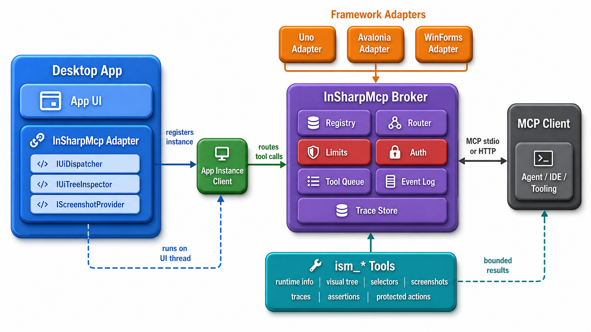

# InSharpMcp

<p align="center">
  
</p>

<p align="center">
  <strong>Framework-independent MCP automation for .NET desktop apps.</strong><br>
  Inspect UI, query elements, capture supported screenshots, trace tool calls, and route actions through framework adapters.
</p>

<table align="center">
  <tr>
    <td align="center"><strong>Core</strong><br>Broker and Bridge</td>
    <td align="center"><strong>Adapters</strong><br>Uno, Avalonia, WinForms</td>
    <td align="center"><strong>Transports</strong><br>stdio and HTTP</td>
    <td align="center"><strong>Tests</strong><br>xUnit projects</td>
  </tr>
</table>

InSharpMcp is a framework-independent MCP automation layer for .NET desktop applications. It gives an MCP client a bounded, structured way to inspect running app instances, query UI elements, capture screenshots, read safe metadata, collect recent events, start traces, run simple assertions, and invoke carefully gated interaction tools.

The base NuGet package, `InSharpMcp`, is independent of any Uno, Avalonia, WinForms, WPF, WinUI, or other UI framework. UI frameworks plug in through separate adapter packages.

The **Broker** is the actual process that will be integrated as the Mcp server in e.g. IDE's like Cursor or VS Code etc. It is not limited to a single app or a single active call. Running apps connect through `InSharpMcp.Bridge`, register as separate app instances, and the broker routes concurrent MCP calls to the selected instance.

This repository currently contains the broker executable, reusable core broker library, app-side Bridge, shared contracts, Uno, Avalonia, and WinForms adapters, adapter tests, and demo apps for the three platform environments.

## Quick Install

- Download the latest Mcp Server (Broker) from the latest release, usually `InSharpMcp.Broker-win-x64.msi`.
- Install it and configure your IDE MCP client, like Cursor/VS Code/OpenCode to run it with `--transport stdio`.
- In your app project, add the base package: `dotnet add package InSharpMcp`.
- Add exactly one adapter package for your UI framework: `InSharpMcp.Adapters.Uno`, `InSharpMcp.Adapters.Avalonia`, or `InSharpMcp.Adapters.WinForms`.
- Register the adapter with the app's main UI root, call `AddInSharpMcpBridge()`, and start `InSharpMcpBridge` with an `AppBridgeRegistration`, see below for example code or run the demo(s).
- If outside of an IDE: run the broker and the app at the same time; once the app registers, MCP tools can inspect and interact with that app instance.
- Inside an IDE, ask your agent to use the InSharpMcp tools and give it a try!

## Table of Contents

- [Current Status](#current-status)
- [Repository Layout](#repository-layout)
- [Requirements](#requirements)
- [Build and Test](#build-and-test)
- [How InSharpMcp Works](#how-insharpmcp-works)
- [Install MCP in IDE](#install-mcp-in-ide)
- [Using NuGet Packages](#using-nuget-packages)
- [Starting the Broker](#starting-the-broker)
- [Adding MCP to Your App](#adding-mcp-to-your-app)
- [Adapter Capabilities](#adapter-capabilities)
- [Interaction Behavior](#interaction-behavior)
- [Client Limit Configuration](#client-limit-configuration)
- [Limits and Safety](#limits-and-safety)
- [Security Model](#security-model)
- [Selecting a Target App](#selecting-a-target-app)
- [Selectors](#selectors)
- [Tool Manual](#tool-manual)
- [Data Returned by Inspection Tools](#data-returned-by-inspection-tools)
- [Development Workflow](#development-workflow)
- [Known Limitations](#known-limitations)
- [License](#license)

## Current Status

Release builds create these NuGet packages:

- `InSharpMcp` `1.0.0`: `net8.0` base package containing `InSharpMcp.Contracts`, `InSharpMcp.Core`, and `InSharpMcp.Bridge`.
- `InSharpMcp.Adapters.Uno` `1.0.0`: Uno Platform adapter using `Uno.Sdk/6.5.33`, targeting `net9.0-windows10.0.19041` and `net9.0-desktop`.
- `InSharpMcp.Adapters.Avalonia` `1.0.0`: Avalonia adapter targeting `net8.0`, with `Avalonia` and `Avalonia.Desktop` pinned to `12.0.3`.
- `InSharpMcp.Adapters.WinForms` `1.0.0`: WinForms adapter targeting `net8.0-windows`.

`InSharpMcp.Broker` is distributed separately as the MCP broker executable through the Windows installer.

The repository includes xUnit test projects for the broker, shared adapter contracts, and framework adapters.

## Repository Layout

The server code lives under `mcp/server`.

| Path | Purpose |
| --- | --- |
| `mcp/server/InSharpMcp.Contracts` | Shared result models, limit models, selectors, screenshots, traces, assertions, and adapter interfaces. |
| `mcp/server/InSharpMcp.Core` | Reusable MCP core library: routing, registry, security, limits, event log, trace store, selectors, assertions, transports, and `ism_` tools. |
| `mcp/server/InSharpMcp.Broker` | Main MCP broker process used by IDEs, MCP clients, and other third-party integrations. |
| `mcp/server/InSharpMcp.Bridge` | App-side local bridge that registers a running app instance with the broker and carries UI operations back to the live adapter. |
| `mcp/server/InSharpMcp.Adapters.Uno` | Uno/WinUI adapter for dispatcher, visual tree, metadata, DataContext, screenshots where supported, inspection-tree accessibility metadata, Windows input, command-backed default action invocation, and property editing. |
| `mcp/server/InSharpMcp.Adapters.Avalonia` | Avalonia adapter for dispatcher, visual tree, metadata, DataContext, screenshots for measured controls, inspection-tree accessibility metadata, Windows input, command-backed default action invocation, and property editing. |
| `mcp/server/InSharpMcp.Adapters.WinForms` | WinForms adapter for dispatcher, control tree, metadata, Tag-based DataContext, screenshots, inspection-tree accessibility metadata, Windows input, button default action invocation, and property editing. |
| `mcp/server/SharedSource` | Source files compiled into multiple adapter assemblies without introducing another project or NuGet package. |
| `mcp/server/tests` | Core tests, shared adapter contract tests, and framework adapter tests. |
| `demos` | Uno, Avalonia, and WinForms demo apps for manual adapter validation. |
| `plans` | Design plan, implementation notes, and verification record. |

## Requirements

Use a current .NET SDK that can build `net8.0`, `net8.0-windows`, and the Uno adapter target frameworks. This repository was verified on Windows.

The WinForms adapter and WinForms demo require Windows. The Uno adapter targets `net9.0-windows10.0.19041` and `net9.0-desktop`. The Avalonia adapter targets `net8.0`.

## Build and Test

From the repository root, build and test the server solution:

```powershell
dotnet build mcp/server/InSharpMcp.sln
dotnet test mcp/server/InSharpMcp.sln
```

Build all demo apps together:

```powershell
dotnet build demos/InSharpMcp.Demos.slnx
```

Run the demo apps individually:

```powershell
dotnet run --project demos/demo.uno/InSharpMcp.Demo.Uno/InSharpMcp.Demo.Uno.csproj -f net9.0-desktop
dotnet run --project demos/demo.avalonia/InSharpMcp.Demo.Avalonia.csproj
dotnet run --project demos/demo.winforms/InSharpMcp.Demo.WinForms.csproj
```

The demos are intentionally small and stable. They expose menus, buttons, inputs, editable text, scrollable text, labels, and framework-specific controls so selectors, screenshots, accessibility, and metadata can be validated manually.

## How InSharpMcp Works

An MCP client talks to `InSharpMcp.Broker`, the main MCP process used by IDEs, MCP clients, and other third-party integrations. The broker owns the MCP tool surface, app registry, target selection, limit clamping, event logging, and local routing. It stays UI-framework-neutral.

A running app does not expose MCP directly. It references `InSharpMcp.Bridge` plus exactly one framework adapter package. The Bridge registers an `AppInstanceDescriptor` with the broker over a local named pipe and carries broker requests back to the live app process.

Adapters provide the framework-specific implementation: UI-thread dispatch, visual tree inspection, metadata, DataContext inspection, screenshots, accessibility data, input, default actions, property editing, and close behavior where supported.

When exactly one compatible app instance is registered, tools can run without an explicit target. When more than one instance matches, InSharpMcp returns `ambiguous_target` instead of guessing. When a selected instance has no active client connection, it returns `stale_instance`.

## Install MCP in IDE

IDE MCP clients should launch `InSharpMcp.Broker` over `stdio`. The app under test must reference `InSharpMcp.Bridge` and be running so it can register itself with the broker.

For live usage, point the IDE directly at `InSharpMcp.Broker.exe`. Use `<path>` for the folder that contains the broker executable, such as a local build output, release unpack folder, or installed tool location.

For Cursor, add an entry like this to `mcp.json`:

```json
{
  "mcpServers": {
    "insharp-mcp": {
      "command": "<path>/InSharpMcp.Broker.exe",
      "args": [
        "--transport",
        "stdio"
      ],
      "env": {
        "ISM_MAX_DEPTH": "20",
        "ISM_MAX_NODES": "500",
        "ISM_MAX_TEXT_CHARACTERS": "64000"
      }
    }
  }
}
```

For Codex, add the same broker command to `%USERPROFILE%\.codex\config.toml`:

```toml
[mcp_servers.InSharpMcp]
command = "<path>/InSharpMcp.Broker.exe"
args = [
  "--transport",
  "stdio",
]
env = { ISM_MAX_DEPTH = "20", ISM_MAX_NODES = "500", ISM_MAX_TEXT_CHARACTERS = "64000" }
```

Developers working from a source checkout can use `dotnet run` instead of a built executable:

```json
{
  "mcpServers": {
    "insharp-mcp": {
      "command": "dotnet",
      "args": [
        "run",
        "--project",
        "<repo>/mcp/server/InSharpMcp.Broker/InSharpMcp.Broker.csproj",
        "--",
        "--transport",
        "stdio"
      ]
    }
  }
}
```

The broker is distributed as an executable through the release installer. It is not the NuGet package that application hosts reference.

## Using NuGet Packages

Application hosts reference the base package plus the adapter for their UI framework. The base package contains shared contracts, core broker services, and `InSharpMcp.Bridge`; adapter packages contain only framework-specific UI access, screenshots, input, and action support.

```powershell
dotnet add package InSharpMcp
dotnet add package InSharpMcp.Adapters.WinForms
```

Use exactly one adapter package for the app framework:

```powershell
dotnet add package InSharpMcp.Adapters.Uno
dotnet add package InSharpMcp.Adapters.Avalonia
dotnet add package InSharpMcp.Adapters.WinForms
```

For local source development before packages are published to a feed, build once, then pack the NuGet projects into a folder and add that folder as a NuGet source. The base package is intentionally produced by `InSharpMcp.Contracts.csproj`: that project has `PackageId=InSharpMcp`, includes its own contracts assembly, and packs the already-built `InSharpMcp.Core.dll` and `InSharpMcp.Bridge.dll` into the same `.nupkg`. `InSharpMcp.Core` and `InSharpMcp.Bridge` are not packed as separate NuGet packages.

```powershell
dotnet build mcp/server/InSharpMcp.sln -c Release
dotnet pack mcp/server/InSharpMcp.Contracts/InSharpMcp.Contracts.csproj -c Release --no-build -o artifacts/nuget
dotnet pack mcp/server/InSharpMcp.Adapters.WinForms/InSharpMcp.Adapters.WinForms.csproj -c Release --no-build -o artifacts/nuget
dotnet nuget add source artifacts/nuget --name InSharpMcpLocal
```

That creates `InSharpMcp.<version>.nupkg` for Contracts + Core + Bridge, plus one adapter package such as `InSharpMcp.Adapters.WinForms.<version>.nupkg`.

Then use the same `dotnet add package` commands. Replace `WinForms` with `Uno` or `Avalonia` when packing and referencing a different adapter.

## Starting the Broker

Starting `InSharpMcp.Broker` is explicit: an IDE MCP client launches it from its MCP configuration, or you run it yourself from a terminal. The broker is not loaded into the app process.

`ISM_ENABLED` is an app-host opt-in flag. Use it in production apps when you want the MCP Bridge to be disabled unless the developer or test runner explicitly enables it. The sample demos skip this guard so they are immediately visible to a running broker.

Set the flag for the current PowerShell session before starting an app that checks it:

```powershell
$env:ISM_ENABLED = "1"
```

Unset it again to return to the default disabled behavior for guarded hosts:

```powershell
Remove-Item Env:\ISM_ENABLED
```

In app code, treat the flag as a condition before starting `InSharpMcp.Bridge`:

```csharp
if (string.Equals(Environment.GetEnvironmentVariable("ISM_ENABLED"), "1", StringComparison.Ordinal))
{
    await provider.GetRequiredService<InSharpMcpBridge>().StartAsync(registration);
}
```

For IDE MCP clients such as Codex or Cursor, use the broker executable. The default transport is stdio, which is what command-launched MCP clients normally expect.

From a source checkout, the command form is:

```powershell
dotnet run --project mcp/server/InSharpMcp.Broker/InSharpMcp.Broker.csproj -- --transport stdio
```

Optional: you can package `InSharpMcp.Broker` as a .NET tool with the command name `insharp-mcp`. If you choose that installation style, the broker command becomes:

```powershell
insharp-mcp --transport stdio
```

For local HTTP clients, run the same executable in HTTP mode:

```powershell
dotnet run --project mcp/server/InSharpMcp.Broker/InSharpMcp.Broker.csproj -- --transport http --http-port 52001 --http-path /mcp
```

HTTP always binds to `127.0.0.1` and maps the MCP endpoint at `/mcp` by default. Remote HTTP clients are rejected.

## Adding MCP to Your App

App registration is normal dependency injection. Add the adapter for your framework, add `InSharpMcp.Bridge`, and start the bridge with an `AppBridgeRegistration`. Production apps should usually guard `StartAsync` behind an explicit opt-in such as `ISM_ENABLED`. The demo projects under `demos/` are the best starting references because each one wires the MCP Bridge into a real host app.

The exact root type depends on the adapter. Today each adapter attaches one app instance to one UI root: WinForms uses the main `Form`, while Avalonia and Uno use the main `Window.Content` element as the inspectable/screenshot root and keep the main `Window` for app close and coordinate translation. For a typical single-window app, the main form/window content is the app instance surface. Multi-window apps can register the window they want MCP clients to operate against, or expose separate app instance registrations if they need separate controllable surfaces.

A WinForms host can wire its main form like this:

```csharp
using InSharpMcp;
using InSharpMcp.Adapters.WinForms;
using InSharpMcp.Bridge;
using Microsoft.Extensions.DependencyInjection;

var services = new ServiceCollection();
services.AddInSharpMcpWinFormsAdapter(
    form, // Main Form used as this app instance's MCP root.
    appName: "Sample WinForms App",
    appVersion: "1.0.0",
    platformTarget: "WinForms");
services.AddInSharpMcpBridge();

var provider = services.BuildServiceProvider();
var registration = new AppBridgeRegistration(
    AppId: "sample-winforms-app",
    AppName: "Sample WinForms App",
    AdapterKind: "winforms",
    PlatformTarget: "WinForms",
    AppVersion: "1.0.0",
    Capabilities: new HashSet<string>(StringComparer.Ordinal)
    {
        "runtime",
        "visualtree",
        "metadata",
        "datacontext",
        "screenshot",
        "accessibility",
        "input",
        "default-action",
        "property-editing",
        "close"
    });

await provider.GetRequiredService<InSharpMcpBridge>().StartAsync(registration);
```

Dispose the service provider when the host closes. That stops the Bridge and unregisters the app instance from the broker when possible.

Avalonia hosts use `AddInSharpMcpAvaloniaAdapter(window, ...)`.  
Uno hosts use `AddInSharpMcpUnoAdapter(window, ...)`.  
WinForms hosts use `AddInSharpMcpWinFormsAdapter(form, ...)`.

## Adapter Capabilities

The adapters share the same contract shape, but platform support is intentionally honest.

| Adapter | Implemented |
| --- | --- |
| Uno | UI dispatch, app info/close, bounded visual tree, element metadata, DataContext metadata, Windows screenshot capture, inspectable tree metadata with accessibility fields where available, Windows pointer/key/text input through native input APIs, command-backed `ButtonBase` default action invocation, and public property editing for elements and direct DataContext objects. |
| Avalonia | UI dispatch, app info/close, bounded visual tree, element metadata, DataContext metadata, screenshot capture for measured controls, inspectable tree metadata with accessibility fields where available, Windows pointer/key/text input through native input APIs, command-backed default action invocation through `ICommandSource`, and public property editing for elements and direct DataContext objects. |
| WinForms | UI dispatch, app info/close, bounded control tree, element metadata, Tag-based DataContext metadata, `DrawToBitmap` screenshot capture, inspectable tree metadata with accessibility fields where available, Windows pointer/key/text input through native input APIs, default action invocation for `IButtonControl`, and public property editing for controls and Tag-based DataContext objects. |

Unsupported results are normal tool outcomes. They let MCP clients distinguish "this platform path has no validated adapter implementation" from a failure in the app.

## Interaction Behavior

Pointer, keyboard, text, default-action, and property-editing tools are protected operations. They are routed through the selected app instance, run on the adapter dispatcher where UI state is needed, and use structured `ToolResult` outcomes.

Pointer coordinates are adapter-root-relative, not raw desktop/screenshot coordinates. Each adapter rejects raw pointer coordinates outside the registered root bounds before native input is sent. WinForms translates accepted points with `Control.PointToScreen`. Avalonia translates them with Avalonia `PointToScreen`. Uno translates them through the Windows target's native HWND when available; Uno Desktop/Skia pointer clicks remain `unsupported` until a validated backend-specific screen-coordinate path exists.

Prefer `ism_element_click` when the target is a discovered element. It resolves the current element identifier, computes the element center from root-relative bounds, verifies the point is inside both the element and the registered root, then sends native input. When a caller starts from visual evidence such as a screenshot or UI Automation `BoundingRectangle`, first convert the target screen point into the adapter root's client coordinate space before using `ism_pointer_click`. For WinForms, use the actual form handle with Win32 `ScreenToClient`; do not pass UIA screen coordinates directly, and do not rely on manual DPI division. A successful click tool only means the input injector sent a click. Validate the intended effect with state inspection, a screenshot, an event, or a control-specific assertion.

Key and text input use native Windows input APIs instead of fabricated framework events. Key presses accept a single alphanumeric character, `F1` through `F12`, or one of `enter`, `escape`, `tab`, `backspace`, `delete`, `space`, `arrowup`, `arrowdown`, `arrowleft`, `arrowright`, `home`, `end`, `pageup`, and `pagedown`. Modifiers are `alt`, `control`/`ctrl`, `shift`, and `meta`/`win`. Text input is capped by the interaction validator.

Default actions use public control contracts only. Uno invokes `ButtonBase.Command`, Avalonia invokes `ICommandSource.Command`, and WinForms invokes `IButtonControl.PerformClick()`. Elements without those public action surfaces return structured `unsupported`.

Property editing is a developer/debug feature exposed through `ism_set_element_property`. It can set public settable properties on the selected UI element or on its direct DataContext object. Values are supplied as JSON and converted only to supported simple types: strings, booleans, numbers, enums, `DateTime`, `DateTimeOffset`, `Guid`, and framework types with validated string conversion such as colors or brushes where the adapter framework exposes a public converter or `Parse` method. It does not recursively mutate arbitrary object graphs.

## Client Limit Configuration

An HTTP MCP client can connect to the default local endpoint with a configuration shaped like this:

```json
{
  "mcpServers": {
    "insharp-mcp": {
      "url": "http://127.0.0.1:52001/mcp",
      "headers": {
        "X-InSharpMcp-Max-Depth": "20",
        "X-InSharpMcp-Max-Nodes": "500",
        "X-InSharpMcp-Max-Text-Characters": "64000"
      }
    }
  }
}
```

For command-launched or stdio flows, pass the same limit values through environment variables:

```powershell
$env:ISM_MAX_DEPTH = "20"
$env:ISM_MAX_NODES = "500"
$env:ISM_MAX_TEXT_CHARACTERS = "64000"
```

Only inspection limits are client-configurable. Clients cannot change timeout, queue timeout, auth, CORS, host binding, or transport security through those keys.

## Limits and Safety

Inspection tools limit how much UI data they read and return. Defaults are `MaxDepth = 20`, `MaxNodes = 500`, `MaxTextCharacters = 64000`, `Timeout = 5 seconds`, and `QueueTimeout = 2 seconds`.

The server clamps requested values to the configured policy. Depth is clamped between 1 and 50, node count between 1 and 2000, and text characters between 1024 and 256000. Invalid values fall back to defaults.

UI operations run through `IUiOperationQueue`. This keeps unrelated non-UI work from blocking behind UI work while still serializing UI-thread critical sections. If the queue is full or wait time is exceeded, the tool returns a structured busy or timeout result.

## Security Model

Some tools expose private app state or modify the running app. MCP clients should treat these as approval-gated actions:

```text
ism_get_screenshot
ism_get_element_datacontext
ism_pointer_click
ism_element_click
ism_key_press
ism_type_text
ism_element_peer_default_action
ism_set_element_property
ism_close
```

Stdio is intended for IDE-launched local MCP clients, and HTTP is local-only: the broker binds to `127.0.0.1` and rejects non-loopback clients.

## Selecting a Target App

Most tools accept an optional target selector. A target can name an `instanceId`, an `appId`, or an `adapterKind`.

Use `instanceId` when more than one app window or process can be registered. Use `appId` when you know there is only one app instance with that ID. Use `adapterKind` for broad diagnostics only when one compatible instance is registered.

Example selector:

```json
{
  "instanceId": "sample-instance"
}
```

If no target is supplied and exactly one instance is registered, the broker uses that instance. If multiple instances match, the broker returns a candidate list with `ambiguous_target`.

## Selectors

Element selectors are structured JSON objects. They are not CSS, XPath, or a custom string grammar.

```json
{
  "role": "Button",
  "name": "Primary action"
}
```

The supported selector fields are `name`, `automationId`, `type`, `text`, `role`, `index`, `path`, and an adapter-specific `adapter` object. Results are deterministic, bounded, and returned in tree order.

`automationId` comes from the UI framework's automation metadata. Avalonia reads `AutomationProperties.AutomationId`, Uno/WinUI reads `AutomationProperties.AutomationId`, and WinForms maps this field from `AccessibleName`. If an app does not set an automation ID, the value is `null`; use `name`, `text`, `type`, or a discovered `elementIdentifier` instead.

To inspect a tree-like control, an agent should usually start with `ism_visualtree_snapshot`. The initial result is a `ToolResult` whose `data` is a `UiTreeSnapshot`: it contains the root `UiElementNode`, adapter-generated `elementIdentifier` paths, basic metadata such as `type`, `name`, `automationId`, `text`, `role`, visibility and enabled state, plus `nodeCount` and `truncated` so the caller can tell whether limits cut the tree short.

Example initial result:

```json
{
  "success": true,
  "message": "Visual tree snapshot returned.",
  "data": {
    "root": {
      "elementIdentifier": "0",
      "type": "Window",
      "name": "MainWindow",
      "automationId": "mainWindow",
      "text": null,
      "role": "Window",
      "isVisible": true,
      "isEnabled": true,
      "children": [
        {
          "elementIdentifier": "0/1",
          "type": "TreeView",
          "name": "Navigation",
          "automationId": "navigationTree",
          "text": null,
          "role": "TreeView",
          "isVisible": true,
          "isEnabled": true,
          "children": [
            {
              "elementIdentifier": "0/1/0",
              "type": "TreeViewItem",
              "name": "Orders",
              "automationId": "ordersNode",
              "text": "Orders",
              "role": "TreeViewItem",
              "isVisible": true,
              "isEnabled": true,
              "children": []
            }
          ]
        }
      ]
    },
    "nodeCount": 3,
    "truncated": false
  }
}
```

If the agent already knows what it is looking for, it can use `ism_query_elements` directly with fields such as `type`, `name`, or `automationId`. For a first overview, `ism_visualtree_snapshot` is the safer starting point; then use the returned `elementIdentifier` with `ism_get_element_metadata`, `ism_get_element_datacontext`, `ism_element_click`, `ism_element_peer_default_action`, or `ism_set_element_property`. Collapsed or virtualized items appear only when the UI framework has realized them in the current tree.

Element identifiers use adapter-generated tree paths such as `0`, `0/0`, or `0/1/2`. The root is always `0`; each following segment is a zero-based child index. For example, `0/1/2` means root element, second child, then third child. Use `ism_visualtree_snapshot` or `ism_query_elements` to discover identifiers, then pass the identifier to metadata, DataContext, property-editing, or default-action tools.

Element identifiers are handles for the current UI tree shape, not stable application IDs. If the UI tree changes because controls are added, removed, expanded, collapsed, or virtualized, a previously discovered path can point to a different element or stop resolving. Prefer `automationId`, `name`, `text`, or `type` for stable queries where the app exposes them.

## Tool Manual

The tool surface uses the `ism_` prefix.

| Tool | Use it for |
| --- | --- |
| `ism_list_instances` | List registered app instances and their capabilities. |
| `ism_get_runtime_info` | Read PID, OS, platform target, app name, and app version for the selected instance. |
| `ism_visualtree_snapshot` | Get a bounded visual or control tree snapshot. |
| `ism_get_element_metadata` | Read safe metadata for one element identifier. |
| `ism_get_element_datacontext` | Read bounded, non-recursive DataContext metadata. This is protected. |
| `ism_get_screenshot` | Capture a PNG screenshot where the adapter supports it. This is protected. |
| `ism_query_elements` | Find elements with a structured selector. |
| `ism_wait_for_element` | Poll for a matching element until a bounded timeout. |
| `ism_get_accessibility_tree` | Return the selected adapter's inspectable tree with accessibility-related metadata where available. This is not a native platform accessibility-provider tree. |
| `ism_get_event_log` | Read recent bounded, redacted tool and adapter events. |
| `ism_pointer_click` | Request a pointer click using adapter-root/client coordinates, not raw screen pixels. Out-of-root coordinates are rejected. This may return `unsupported`. |
| `ism_element_click` | Resolve an element identifier and click its verified in-bounds center. This is protected and may return `unsupported`, `not_found`, `not_clickable`, or `out_of_bounds`. |
| `ism_key_press` | Request a key press. This is protected and may return `unsupported`. |
| `ism_type_text` | Request text input. This is protected and may return `unsupported`. |
| `ism_element_peer_default_action` | Invoke a public default action where the adapter supports it. This is protected. |
| `ism_set_element_property` | Set a public settable property on an element or its direct DataContext object. This is protected. |
| `ism_close` | Request a graceful close. This is protected. |
| `ism_start_trace` | Start recording bounded events for a selected instance. |
| `ism_stop_trace` | Stop a trace and return a summary. |
| `ism_assert_element_exists` | Return a structured pass/fail result for element existence. |
| `ism_assert_element_text` | Return a structured pass/fail result for matching element text. |
| `ism_assert_element_enabled` | Return a structured pass/fail result for enabled state. |

Normal assertion failures return successful tool calls with an `AssertionResult` whose `Passed` value is `false`. They do not throw as tool errors.

## Data Returned by Inspection Tools

Visual-tree snapshots are built from `UiElementNode`. Nodes include an element identifier, type, optional name, optional automation ID, optional text, optional role, optional visible/enabled states, optional root-relative bounds, and children.

Element metadata uses the same safe fields without child nodes, including root-relative bounds where the adapter can compute them. DataContext metadata includes the DataContext type name and public primitive/string-like properties only. It does not recursively walk arbitrary object graphs, and sensitive property names such as password, secret, token, or key are redacted. Property-editing results include the element identifier, edited target object, property name, target type, property type, and formatted previous/new values where readable.

Trace summaries contain a trace ID, timestamps, bounded event entries, and a truncation flag.

## Development Workflow

This repository uses central package management in `Directory.Packages.props`. Project files should normally use versionless `PackageReference` entries.

For normal development, run:

```powershell
dotnet build mcp/server/InSharpMcp.sln
dotnet test mcp/server/InSharpMcp.sln
dotnet build demos/InSharpMcp.Demos.slnx
```

After repeated builds, you can shut down .NET build servers with:

```powershell
dotnet build-server shutdown
```

The existing tests cover routing, target ambiguity, stale instances, local broker transport, limit clamping, UI queue behavior, selector matching, waits, event redaction, tracing, assertions, adapter contracts, and framework adapter smoke behavior.

## Known Limitations

The included Bridge provides a local named-pipe app-to-broker transport for desktop apps on the same machine. Production hosts can use it directly or replace it with a custom transport if they need a different discovery, authentication, or deployment model.

Uno Desktop/Skia screenshots remain unsupported until a validated backend-specific implementation exists. Uno pointer clicks require a native Windows window handle and return `unsupported` when one is not available.  
Keyboard/text input uses native Windows input where available. Default action invocation is limited to public command/button patterns: Uno `ButtonBase.Command`, Avalonia `ICommandSource.Command`, and WinForms `IButtonControl.PerformClick()`.

The file `plans/ADAPTER_VALIDATION.md` records the current adapter validation status and remaining structured unsupported paths.

## License

MIT licensed. See `LICENSE`.
